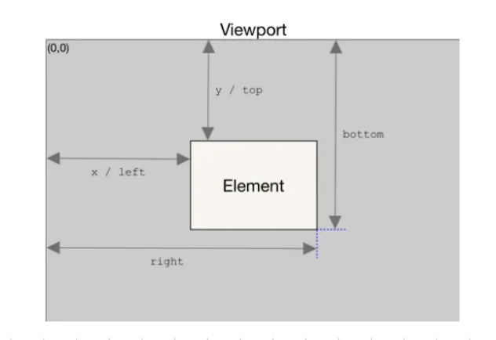

# 10个Javascript常见高级知识点


## 1. 防抖

定义：在事件被触发n秒后再执行回调，如果在这n秒内又被触发，则重新计时。

```ts
function debounce (fn, time) {
  let timer
  return function () {
    clearTimeout (timer)
    let args = arguments
    timer = setTimeout(() =>
      fn.apply(this, args)
    , time)
  }
}
```


## 2. 节流

定义：规定在一个单位时间内，只能触发一次函数。如果这个单位时间内触发多次函数，只有一次生效。

```ts
function throttle(func, delay) {
  let timer = null;
  let lastTime = 0;
 
  return function() {
    const context = this;
    const args = arguments;
    const now = new Date().getTime();
 
    if (now - lastTime >= delay) {
      clearTimeout(timer);
      func.apply(context, args);
      lastTime = now;
    } else {
      clearTimeout(timer);
      timer = setTimeout(function() {
        func.apply(context, args);
        lastTime = now;
      }, delay);
    }
  };
}
```


## 3.高阶函数

定义：接受和/或返回另外一个函数的函数被称为高阶函数。常见的像数组的map、reduce、filter这些都是高阶函数

```ts
//筒单的高阶西数
function add(x, y, fn) {
  return fn(x) + fn(y);
}
function fn(num) {
  return Math.abs(num);
}
add(-5, 6, fn); // 11
```


## 4.函数柯里化

定义：函数柯里化指的是将能够接收多个参数的函数转化为接收单一参数的函数，并且返回接收余下参数且返回结果的新函数的技术。

函数柯里化的主要作用和特点就是参数复用、提前返回和延迟执行。

```ts
//普通的add西数
function add(x, y) {
  return x + y;
}
//柯里化后
function curryingAdd(x) {
  return function (y) {
    return x + y;
  };
}
add(1, 2);
// 3
curryingAdd(1)(2);
// 3
```

```ts
function curry(func) {
  return function curried(...args) {
    if (args.length >= func.length) {
      return func.apply(this, args);
    } else {
      return function(...args2) {
        return curried.apply(this, args.concat(args2));
      }
    }
  };
}

// 用例
function sum(a, b, c) {
  return a + b + c;
}

let curriedSum = curry(sum);
console.log(curriedSum(1, 2, 3)); // 6，仍然可以被正常调用
console.log(curriedSum(1)(2,3)); // 6，对第一个参数的柯里化
console.log(curriedSum(1)(2)(3)); // 6，全柯里化
```


## 5. 数组去重

1⃣️Set去重

```ts
const arr = [1,1,2,2,3,3,4,4,5,5];
const res = Array.from(new Set(arr));
console.log(res); // [1,2,3,4,5]
```

2⃣️filter去重

```ts
const removeRepeat = (arr) => {
  return arr.filter((item, index) =› arr.indexof(item, 0) === index)
});
```

3⃣️includes去重

```ts
const removeRepeat = (arr) => {
  let repeatArr = [];
  for (let i = 0, len = arr.length; i < len; i++) { 
    if (repeatArr.includes(arr[i])) {
      repeatArr.push(arr[i])
    }
  }
  return repeatArr;
};
```


## 6. 数组扁平化

1⃣️flat方法

```ts
const arr = [1, [2, [3, [4, 5]]], 6]
function flatten(arr) {
  return arr.flat(Infinity) // 嵌套深度
}
console.log(flatten(arr)); // [1, 2, 3, 4, 5, 6]
```

2⃣️toString

```ts
function flatten(arr) {
  return arr.toString().split(',').map(x => parseFloat(x))
}
console.log(flatten(arr));
```

3⃣️正则

```ts
function flatten(arr) {
  let str = JSON.stringify(arr).replace(/\[|\]/g, '');
  str = '[' + str + ']'
  arr = JSON.parse(str);
  return arr;
}
console.log(flatten(arr))
```

4⃣️循环递归

```ts
function flatten(arr) {
  let result = [];
  for (let i = 0; i < arr.length; i++) {
    if (Array.isArray(arr[i])) {
      result = result.concat(flatten(arr[i]));
    } else {
      result.push(arr[i]);
    }
  }
  return result;
}
console.log(flatten(arr));
```


## 7. 深拷贝

```ts
function deepClone(obj) {
  if (typeof obj !== 'object' || obj === null) return obj;
  
  let newObj = Array.isArray(obj) ? [] : {};
  
  if (obj instanceof Date) {
    newObj = new Date(obj)
  }
  
  if (obj instanceof RegExp) {
    newObj = new RegExp(obj)
  }
  
  for (let key in obj) {
    if (obj.hasOwnProperty(key)) {
      newObj[key] = typeof obj[key] == 'object' ? deepClone(obj[key]) : obj[key]
    }
  }
  return newObj;
}
```


## 8. getBoundingCilentRect

什么是getBoundingCilentRect?

getBoundingCilentRect用于获得页面中某个元素的左，上，右和下分别相对浏览器视窗的位置。该函数返回一个对象，该对象有6个属性：top,lef,right,bottom,width,height，如图：



判断某个元素是否滚动到了可视区域内

```ts
window.onscroll = function() {
  const box = document.querySelector('.box');
  const clientHeight = window.innerHeight || document.documentElement.clientHeight;
  const boxTop = box.getBoundingClientRect().top
  
  if (boxTop <= clientHegiht) {
    // 可以控制元素的显示隐藏或者进行其他操作
  }
}
```


## 9. IntersectionObserver

使用`IntersectionObserver`实现图片的懒加载

```html
<body>
  
  
  
  
</body>
```

```js
function observe() {
  let images = document.querySelectorAll('img');
  let observer = new IntersectionObserver(enteries => {
    entries.forEach(item => {
      if (item.isIntersecting) {
        item.target.src = item.target.dataset.origin;
        observer.unobserve(item.target);
      }
    });
  }, {
    rootMargin: '0 0 300px 0' // 监视区向下扩展300px
  });
  images.forEach(item => observer.observe(item));
}
observe();
```


## 10. 自定义事件

什么是自定义事件？

在开发的过程中，我们会监听很多的事件，比如：点击事件(click)、鼠标移动事件(mousemove)等等。这些事件是js给我们提供的，但是有时候这些事件并不能满足我们的开发需要，这个时候就可以用自定义事件来解決。自定义事件可以让我们自主命名事件名，并且可以通过特定的方法进行添加，触发以及删除。

如何使用

目前实现自定义事件的两种主要方式是is的 Event0构造函数和

CustomEvent() 构造函数来创建。

1⃣️Event

Event() 造函数，用来創建一个新的事件対象 Event。

```ts
// typeArg: string※型、表示創建事件的各都
// eventInit:object类型，可选项，参数包括：bubbles-表示该事件是吾旨泡;cance Lable-
let myevent = new Event(typeArg, eventInit);
```

演示:

```js
const btn = document.querySelector('button');
let myEvent = new Event('myEvent', {
  bubbles: true // 是否冒泡
})；
btn.addEventListener('click', function() {
  dispatchEvent(myEvent);
});
window.addEventListener('myEvent', function() {
  console.log('触发了自定义事件')
});
```

2⃣️CustomEvent

Custom Event()构造函数，创建一个新的事件对象 CustomEvent。

```js
// typeArg: string类型，表示创建事件的吉称
// eventInit: object类型，可选项，参数包括：bubbles-表示该事件是吾旨泡;cance LabLe-
let myEvent = new CustomEvent(typeArg, eventInit);
```

演示:

```js
const btn = document.querySelector('button');
let myEvent = new CustomEvent('myEvent', {
  detail: {
    name: '秦爱德'
  }
});
btn.addEventListener('click', function() {
  // 触发自定义事件
  dispatchEvent(myEvent);
});
window.addEventListener('myEvent', function(e) {
  console.log(`触发了自定义事件， name为${e.detail.name}`);
})
```

3⃣️Event 和 CustomEvent 区别

Event()一般用来创建简单的自定义事件，而 CustomEvent() 支持传递

参数的自定义事件，它支持 detail 参数，可以在detail中放一些需要传递的参数，并在事件监听函数中获取。