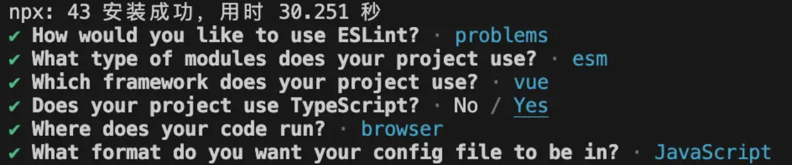

# 搭建vue框架

## 1. Typescript

```shell
pnpm create vite my-vue-app --template vue-ts
```

## 2. Alias

安装依赖

```shell
pnpm add -D @types/node
```

在`vite.config.js`的`defineConfig`增加

```js
// 头部饮用
import path from 'path'

// 增加到defineConfig下
{
  resolve: {
    alias: {
      '@': path.resolve(__dirname, 'src')
    }
  },
}
```

在`tsconfig.json`的`compilerOptions`增加

```json
{
  "paths":{
     "@/*": ["./src/*"],
   },
}
```


## 3. Linter / Formatter

### 3.1 安装eslint

```shell
npm init @eslint/config
````



按需选择完配置后，选择立即安装，就可一键安装相关依赖。安装成功后 ESLint 帮我们创建了 .eslintrc.cjs 配置文件（cjs 是指 CommonJS 格式）

```js
module.exports = {
    "env": {
        "browser": true,
        "es2021": true
    },
    "extends": [
        "eslint:recommended",
        "plugin:@typescript-eslint/recommended",
        "plugin:vue/vue3-essential"
    ],
    "overrides": [
        {
            "env": {
                "node": true
            },
            "files": [
                ".eslintrc.{js,cjs}"
            ],
            "parserOptions": {
                "sourceType": "script"
            }
        }
    ],
    "parserOptions": {
        "ecmaVersion": "latest",
        "parser": "@typescript-eslint/parser",
        "sourceType": "module"
    },
    "plugins": [
        "@typescript-eslint",
        "vue"
    ],
    "rules": {
    }
}

```

在 `package.json` 的 `script` 中添加命令

```json
{
  "scripts": {
    "lint": "eslint --ext .ts,.vue,.js, --fix --quiet ./"
  },
}
```

### 3.2. 增加prettier

```shell
yarn add prettier -D
```

然后再根目录创建 .prettierrc.js 配置文件

```js
module.exports = {
  printWidth: 80,
  tabWidth: 2,
  useTabs: false,
  singleQuote: true,
  semi: false,
  trailingComma: 'es5',
  bracketSpacing: true,
  endOfLine: 'auto'
}
```

测试prettier是否生效，在 `package.json` 的 `script` 中添加命令

```json
{
  "scripts": {
    "prettier":"prettier --write ./src/App.vue"
  },
}
```

### 3.3. ESLint + Prettier

在eslint校验中加入Prettier格式化，安装依赖

```shell
yarn add eslint-config-prettier eslint-plugin-prettier -D
```

更改 Eslint 的配置文件 `.eslintrc.cjs`, 在里面加入 Prettier 相关配置

```js
module.exports = {
  "env": {
    "browser": true,
    "es2021": true
  },
  "extends": [
    "eslint:recommended",
    "plugin:@typescript-eslint/recommended", 
    "plugin:vue/vue3-essential",
+    "plugin:prettier/recommended"
  ],
  "overrides": [
    {
      "env": {
        "node": true
      },
      "files": [".eslintrc.{js,cjs}"],
      "parserOptions": {
        "sourceType": "script"
      }
    }
  ],
  "parserOptions": {
    "ecmaVersion": "latest",
    "parser": "@typescript-eslint/parser",
    "sourceType": "module"
  },
  "plugins": [
    "@typescript-eslint",
    "vue",
+    "prettier"
  ],
  "rules": {
+    "prettier/prettier": "error",
+   "arrow-body-style": "off",
+   "prefer-arrow-callback": "off"
  }
}

```

### 3.4 给vscode增加格式化

然后在 `.vscode/settings.json` 添加相关配置。

```json
{
  "editor.tabSize": 2, // Tab 的大小 2个空格
  "editor.formatOnSave": true, // 保存是格式化
  "prettier.singleQuote": true, // 单引号
  "editor.defaultFormatter": "esbenp.prettier-vscode",
  "[vue]": {
    "editor.defaultFormatter": "esbenp.prettier-vscode"
  },
  "editor.codeActionsOnSave": {
    "source.fixAll.eslint": true
  }
}
```

## 4. Husky + lint-staged

### 4.1 安装husky

```shell
pnpm add husky -D
```

然后在 package.json 中添加脚本 prepare 并运行

```shell
npm pkg set scripts.prepare="husky install"

npm run prepare
```

运行命令后会在项目根目录创建 .husky 文件夹。
现在给 Husky 添加一个 Hook

```shell
npx husky add .husky/pre-commit "npm run lint"
```

### 4.2 安装lint-staged

```shell
pnpm add lint-staged -D
```

然后在 `package.json` 添加相关配置。

```json
{
  "lint-staged": {
    "*.{ts,vue}": [
      "npm run lint",
      "prettier --write"
    ]
  }
}
```

## 5.AutoImport

**unplugin-auto-import**：为 Vite、Webpack、Rollup 和 esbuild **按需自动导入 API**。支持 TypeScript。

**unplugin-vue-components**：Vue 的**按需组件自动导入**。

### 5.1 安装

```shell
pnpm add -D unplugin-auto-import
pnpm add -D unplugin-vue-components
```

### 5.2 修改vite版本

修改 vite.config.ts 文件内容，在此以 ElementPlusResolver 为例，其他组件类同。

```tsx
import AutoImport from 'unplugin-auto-import/vite'
import Components from 'unplugin-vue-components/vite'
import { ElementPlusResolver } from 'unplugin-vue-components/resolvers'

AutoImport({
  imports: ["vue", "vue-router"],
  resolvers: [ElementPlusResolver()],
  dts: "src/types/auto-import.d.ts",
  eslintrc: {
    enabled: true
  },
}),
Components({
  resolvers: [ElementPlusResolver()],
  dts: 'src/types/components.d.ts'
}),

```

eslintrc 中 enabled 设置为 true，保存之后会随即在跟目录下生成 .eslintrc-auto-import.json 文件。

```json
{
  "globals": {
    "EffectScope": true,
    "computed": true,
    "createApp": true,
    "customRef": true,
    "defineAsyncComponent": true,
    "defineComponent": true,
    "effectScope": true,
    "getCurrentInstance": true,
    "getCurrentScope": true,
    "h": true,
    "inject": true,
    "isProxy": true,
    "isReactive": true,
    "isReadonly": true,
    "isRef": true,
    "markRaw": true,
    "nextTick": true,
    "onActivated": true,
    "onBeforeMount": true,
    "onBeforeRouteLeave": true,
    "onBeforeRouteUpdate": true,
    "onBeforeUnmount": true,
    "onBeforeUpdate": true,
    "onDeactivated": true,
    "onErrorCaptured": true,
    "onMounted": true,
    "onRenderTracked": true,
    "onRenderTriggered": true,
    "onScopeDispose": true,
    "onServerPrefetch": true,
    "onUnmounted": true,
    "onUpdated": true,
    "provide": true,
    "reactive": true,
    "readonly": true,
    "ref": true,
    "resolveComponent": true,
    "resolveDirective": true,
    "shallowReactive": true,
    "shallowReadonly": true,
    "shallowRef": true,
    "toRaw": true,
    "toRef": true,
    "toRefs": true,
    "triggerRef": true,
    "unref": true,
    "useAttrs": true,
    "useCssModule": true,
    "useCssVars": true,
    "useLink": true,
    "useRoute": true,
    "useRouter": true,
    "useSlots": true,
    "watch": true,
    "watchEffect": true,
    "watchPostEffect": true,
    "watchSyncEffect": true
  }
}
```

### 5.3 .eslintrc.cjs

然后将这个文件引入 .eslintrc.cjs

```tsx
extends: [ 
    // ...
    './.eslintrc-auto-import.json' 
]
```

## 6. SvgIcon

### 6.1 安装插件

```shell
pnpm add vite-plugin-svg-icons -D
```

### 6.2 修改vite内容

Vite.config.ts 中配置

```ts
import { createSvgIconsPlugin } from 'vite-plugin-svg-icons'
import path from 'path'

export default () => {
  return {
    plugins: [
      createSvgIconsPlugin({
        // 指定需要缓存的图标文件夹
        iconDirs: [path.resolve(process.cwd(), 'src/icons')],
        // 指定symbolId格式
        symbolId: 'icon-[dir]-[name]',

        /**
         * 自定义插入位置
         * @default: body-last
         */
        // inject?: 'body-last' | 'body-first'

        /**
         * custom dom id
         * @default: __svg__icons__dom__
         */
        // customDomId: '__svg__icons__dom__',
      }),
    ],
  }
}
```

### 6.3 修改main内容

在 `src/main.ts`内引入注册脚本

```ts
import 'virtual:svg-icons-register'
```

### 6.4 增加svg-icon组件

在 `src/components/svg-icon.vue`

```vue
<script lang="ts" setup>
export interface SvgIconProps {
  prefix?: string
  name: string
  size?: string
}

const props = withDefaults(defineProps<SvgIconProps>(), {
  prefix: 'icon',
  size: '1em'
})

const symbolId = computed(() => '#' + props.prefix + '-' + props.name)
</script>

<template>
  <svg
    aria-hidden="true"
    class="svg-icon"
    :width="props.size"
    :height="props.size"
  >
    <use :xlink:href="symbolId" />
  </svg>
</template>

```

### 其他

在 icons 目录增加

```
# src/icons
- icon1.svg
- icon2.svg
- icon3.svg
```

页面使用

```vue
<svg-icon name="icon1" />
```

获取iconsNames

```ts
import iconNames from 'virtual:svg-icons-names'
// => ['icon-icon1','icon-icon2','icon-icon3']
```

## 7. Router(插件)

### 7.1 安装路由

```shell
pnpm add vue-router@4
+pnpm add unplugin-vue-router -D
```

### 7.2 增加`src/route.ts`内容如下

```ts
import { createRouter, createWebHistory } from 'vue-router/auto'
import { routes } from 'vue-router/auto/routes'

const router = createRouter({
  history: createWebHistory(),
  routes
})

export default router
```

### 7.3 修改src/main.ts

```ts
import { createApp } from 'vue'
import './style.css'
import App from './App.vue'
import 'virtual:svg-icons-register'
+ import router from './router'

createApp(App)
+  .use(router)
  .mount('#app')

```

### 7.4 修改vite.config.ts

```ts
import { defineConfig } from 'vite'
import vue from '@vitejs/plugin-vue'
import path from 'path'
import AutoImport from 'unplugin-auto-import/vite'
import Components from 'unplugin-vue-components/vite'
import { ElementPlusResolver } from 'unplugin-vue-components/resolvers'
import { createSvgIconsPlugin } from 'vite-plugin-svg-icons'
+import VueRouter from 'unplugin-vue-router/vite'
+import { VueRouterAutoImports } from 'unplugin-vue-router'

// https://vitejs.dev/config/
export default defineConfig({
  resolve: {
    alias: {
      '@': path.resolve(__dirname, 'src')
    }
  },
  plugins: [
    vue(),
    AutoImport({
      imports: [
        'vue', 
        'vue-router', 
+        VueRouterAutoImports
      ],
      resolvers: [ElementPlusResolver()],
      dts: 'src/types/auto-import.d.ts',
      eslintrc: {
        enabled: true
      }
    }),
    Components({
      resolvers: [ElementPlusResolver()],
      dts: 'src/types/components.d.ts'
    }),
    createSvgIconsPlugin({
      // 指定需要缓存的图标文件夹
      iconDirs: [path.resolve(process.cwd(), 'src/icons')],
      // 指定symbolId格式
      symbolId: 'icon-[dir]-[name]'
    }),
+    VueRouter({
+      /* options */
+      routesFolder: 'src/views',
+      dts: 'src/types/typed-router.d.ts'
+    })
  ]
})

```


## 8. 加载Element-plus

### 8.1 安装依赖

```shell
pnpm add element-plus
pnpm add @element-plus/icons-vue
```

### 8.2 安装自动加载icon

```shell
pnpm add unplugin-icons -D
```

### 8.3 添加`vite.config.ts`配置

```ts
import { defineConfig } from 'vite'
import vue from '@vitejs/plugin-vue'
import path from 'path'
import AutoImport from 'unplugin-auto-import/vite'
import Components from 'unplugin-vue-components/vite'
import { createSvgIconsPlugin } from 'vite-plugin-svg-icons'
import VueRouter from 'unplugin-vue-router/vite'
import { VueRouterAutoImports } from 'unplugin-vue-router'
+import { ElementPlusResolver } from 'unplugin-vue-components/resolvers'
+import Icons from 'unplugin-icons/vite'
+import IconsResolver from 'unplugin-icons/resolver'

// https://vitejs.dev/config/
export default defineConfig({
  resolve: {
    alias: {
      '@': path.resolve(__dirname, 'src')
    }
  },
  plugins: [
    vue(),
    AutoImport({
      imports: ['vue', 'vue-router', VueRouterAutoImports],
      resolvers: [
+        ElementPlusResolver(),
+        // 自动导入图标组件
+        IconsResolver({
+          prefix: 'Icon'
+        })
      ],
      dts: 'src/types/auto-import.d.ts',
      eslintrc: {
        enabled: true
      }
    }),
    Components({
      resolvers: [
+        ElementPlusResolver(),
+        // 自动注册图标组件
+        IconsResolver({
+          enabledCollections: ['ep']
+        })
      ],
      dts: 'src/types/components.d.ts'
    }),
    createSvgIconsPlugin({
      // 指定需要缓存的图标文件夹
      iconDirs: [path.resolve(process.cwd(), 'src/icons')],
      // 指定symbolId格式
      symbolId: 'icon-[dir]-[name]'
    }),
    VueRouter({
      /* options */
      routesFolder: 'src/views',
      dts: 'src/types/typed-router.d.ts'
    }),
+    Icons({
+      autoInstall: true
+    })
  ]
})

```


## 9. Pinia

## 10. Commitlint
