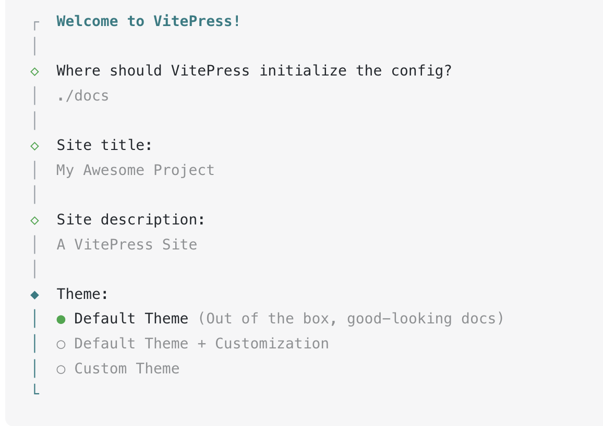

# 实用组件库

## 1. 搭建框架

### 安装脚本

https://vitepress.dev/

```sh
pnpm add -D vitepress
pnpm dlx vitepress init
```



### 安装demo-block

```sh
pnpm add vitepress-theme-demoblock -D
```

增加`.vitepress/theme/index.ts` 

```ts
import DefaultTheme from 'vitepress/theme'
import 'vitepress-theme-demoblock/dist/theme/styles/index.css'
import { useComponents } from './use-components'
import ElementPlus from 'element-plus'
import 'element-plus/dist/index.css'

export default {
  ...DefaultTheme,
  enhanceApp(ctx) {
    DefaultTheme.enhanceApp(ctx)
    useComponents(ctx.app)
    ctx.app.use(ElementPlus)
  },
}

```

增加`.vitepress/theme/use-components.ts` 

```ts
// Don't remove this file, because it registers the demo components.
import Demo from 'vitepress-theme-demoblock/dist/client/components/Demo.vue'
import DemoBlock from 'vitepress-theme-demoblock/dist/client/components/DemoBlock.vue'

export function useComponents(app) {
  app.component('Demo', Demo)
  app.component('DemoBlock', DemoBlock)
}
```

### 增加`test.md`

````
# Test 测试组件

## 说明

描述

:::demo

```vue
<script lang="ts" setup>
</script>
<template>
  <el-button>Default</el-button>
  <el-button type="primary">Primary</el-button>
  <el-button type="success">Success</el-button>
  <el-button type="info">Info</el-button>
  <el-button type="warning">Warning</el-button>
  <el-button type="danger">Danger</el-button>
</template>
```

:::
````

### 增加 `.vitepress/config.mts`

```ts
import { defineConfig } from 'vitepress'
+import {
+  demoblockPlugin,
+  demoblockVitePlugin,
+} from "vitepress-theme-demoblock";


// https://vitepress.dev/reference/site-config
export default defineConfig({
  title: "My Awesome Project",
  description: "A VitePress Site",
  themeConfig: {
    // https://vitepress.dev/reference/default-theme-config
    nav: [
      { text: 'Home', link: '/' },
      { text: 'Examples', link: '/markdown-examples' }
    ],

    sidebar: [
      {
        text: 'Examples',
        items: [
          { text: 'Markdown Examples', link: '/markdown-examples' },
          { text: 'Runtime API Examples', link: '/api-examples' },
+          { text: 'Test', link: '/test' },
        ]
      }
    ],

    socialLinks: [
      { icon: 'github', link: 'https://github.com/vuejs/vitepress' }
    ],
  },
+  markdown: {
+    config: (md) => {
+      md.use(demoblockPlugin);
+    },
+  },
+  vite: {
+    plugins: [demoblockVitePlugin()],
+  },
})

```


## 2. 按钮组件（支持防重点击）